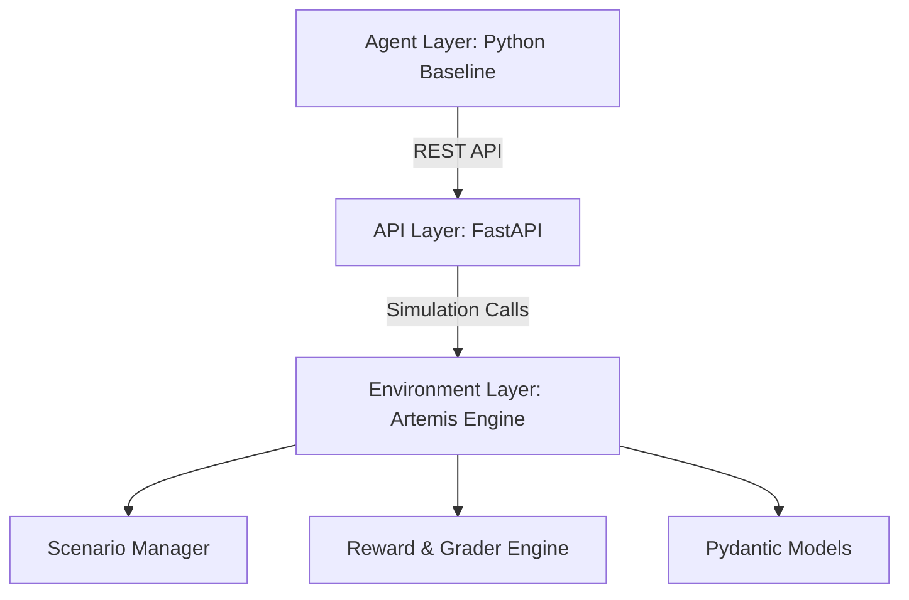

# Artemis: SOC Triage Benchmark

Artemis is a premium, reproducible **OpenEnv** benchmark engineered for the evaluation of AI agents in high-fidelity Security Operations Center (SOC) triage scenarios. It provides a standardized framework to train, test, and validate autonomous decision-making in cybersecurity.

[](https://github.com/openenv-org/openenv)
[](LICENSE)
[](https://www.python.org/downloads/)
[](https://llama.meta.com/)
[](https://openai.com/)

---

## Mission Control

- [Overview](#overview)
- [Quick Start](#quick-start)
- [Task Specifications](#task-specifications)
- [Environment API](#environment-api)
- [Baseline Performance](#baseline-performance)
- [Architecture and Design](#architecture-and-design)
- [Deployment](#deployment)
- [Testing](#testing)
- [Contributing](#contributing)

---

## Overview

### The Challenge: Alert Fatigue

In modern enterprise security, Security Operations Centers (SOCs) are overwhelmed by sheer volume. With alerts scaling from **10,000 to 1,000,000 daily**, and a **false positive rate of 80-90%**, human analysts are pushed to their limits. **Artemis** addresses this critical bottleneck by providing a realistic training ground for AI agents to automate the triage process.

### The Artemis Solution

Artemis simulates a sophisticated SOC dashboard where agents execute real-world triage actions:
- **Triage**: Distinguish between noise and genuine threats.
- **Remediate**: Isolate malicious IPs and compromise user accounts.
- **Investigate**: Deep-dive into logs and temporal file access patterns.
- **Escalate**: Strategically involve human analysts when high-stakes ambiguity arise.

### Key Value Propositions

- 🛡️ **Operational Realism** – Incidents modeled after authentic attack signatures.
- 🎲 **Stochastic Scenario Generation** – 9 rigorous procedural variants across 3 core task tracks prevent basic memorization.
- 📊 **Deterministic Evaluation** – Seed-controlled reproducible trajectories for rigorous scientific benchmarking.
- 🎯 **Task-Specific Precision Graders** – Granular scoring driven by customized ground-truth rubrics rather than weak heuristics.
- 💎 **Signal-Rich Rewards** – Partial credit for investigative steps and early threat isolation.
- 🚀 **High Efficiency** – Optimized for speed; complete global benchmarks in under 3 minutes.
- 📦 **OpenEnv Compliance** – Native support for the OpenEnv `reset/step/state` interface.

---

## Quick Start

Initialize the Artemis benchmark and run the baseline agent in under 2 minutes.

```bash
# Clone the benchmark repo
git clone https://github.com/MONSTER4REX/ARTEMIS.git
cd ARTEMIS

# Setup environment
pip install -r requirements.txt

# Configure your OpenEnv environment
export HF_TOKEN="your-huggingface-token"
export API_BASE_URL="https://api.openai.com/v1" 
export MODEL_NAME="gpt-4-0125-preview"
export ENV_URL="http://localhost:7860" # Or your HF Space URL

# Execute baseline inference
python inference.py
```

---

## Task Specifications

Artemis offers three core difficulty tiers designed to test different cognitive layers of an AI agent.

### 🟢 Tier 1: Triage Signal & Noise (Easy)
**Objective**: Filter obvious false positives from a noisy dashboard.
- **Scenario**: Internal SQL injection tests and known research scanners (Shodan).
- **Core Skill**: Contextual awareness and allowlist recognition.
- **Target Metric**: >95% accuracy.

### 🟡 Tier 2: Pattern Recognition (Medium)
**Objective**: Detect and mitigate a coordinated multi-source Brute Force attack.
- **Scenario**: Coordinated failed logins followed by a successful compromise.
- **Core Skill**: Temporal correlation and proactive IP isolation.
- **Target Metric**: >75% accuracy.

### 🔴 Tier 3: Temporal Synthesis (Hard)
**Objective**: Uncover sophisticated multi-stage lateral movement.
- **Scenario**: Unusual login from a new geo-location → Sensitive file access → Internal API calls.
- **Core Skill**: Hypothesis testing, long-horizon reasoning, and risk judgment.
- **Target Metric**: >60% accuracy.

---

## Environment API

The Artemis API follows the **OpenEnv Specification** for seamless integration with existing AI agent frameworks.

<details>
<summary><b>1. POST /reset</b> - Initialize Episode</summary>

```json
{
  "task": "lateral_movement_detection",
  "seed": 42
}
```
</details>

<details>
<summary><b>2. POST /step</b> - Execute Action</summary>

```json
{
  "episode_id": "ep_abc123",
  "action": {
    "action_type": "isolate_user",
    "user_id": "admin_alpha",
    "reason": "Compromised user exhibiting lateral movement patterns."
  }
}
```
</details>

<details>
<summary><b>3. GET /state</b> - Inspect Environment</summary>

Returns the full internal simulation state for debugging and audit purposes.
</details>

<details>
<summary><b>4. GET /leaderboard</b> - Live Rankings</summary>

Returns the global curated dataset leaderboard comparing major model families against the environment tiers.
</details>

---

## Baseline Performance

Standardized performance metrics across top-tier models for the Artemis v1.2.0 benchmark.

| Model Hierarchy | Easy (T1) | Medium (T2) | Hard (T3) | Average |
|-----------------|-----------|-------------|-----------|---------|
| **OpenAI GPT-4o**| 0.91      | 0.78        | 0.64      | **0.78**|
| **Intelligent Baseline**| 0.88 | 0.75      | 0.60      | **0.74**|
| **Llama-3 (70B)** | 0.86      | 0.71        | 0.49      | **0.69**|
| **Llama-3 (8B)**  | 0.68      | 0.51        | 0.22      | **0.47**|

*Note: Benchmarks performed with standard Artemis system prompts and default scenario seeds across all 9 deterministic variants.*

---

## Architecture and Design

Artemis is built with a decoupled 3-tier architecture for maximum scalability and portability.



- **Environment Layer**: Pure Python simulation logic (stateless, deterministic).
- **API Layer**: Performance-tuned FastAPI server with OpenAPI documentation.
- **Deployment**: Dockerized for zero-config hosting on Hugging Face Spaces.

---

## Deployment

### Local Execution (Docker)

```bash
docker build -t artemis:latest .
docker run -p 7860:7860 artemis:latest
```

### Production Hosting (Hugging Face)

1. Create a **Docker Space** on Hugging Face.
2. Push your repository to the HF remote.
3. Access your live endpoint: **https://rudreshrx-artemis.hf.space**

---

## Testing

Ensuring the integrity of the benchmark is paramount. Artemis includes a comprehensive suite of unit and integration tests.

```bash
# Run all core environment tests
pytest tests/test_environment.py

# Validate grading logic
pytest tests/test_grading.py

# Perform full baseline validation
./scripts/validate-submission.sh
```

---

## 🔗 Integration Examples

### OpenAI GPT-4 Integration

```python
import os
from openai import OpenAI

client = OpenAI(
    base_url=os.getenv("API_BASE_URL"),
    api_key=os.getenv("HF_TOKEN")
)

def get_action(observation):
    return client.chat.completions.create(
        model=os.getenv("MODEL_NAME"),
        messages=[{"role": "user", "content": observation}],
        response_format={"type": "json_object"}
    )
```

### Meta Llama / Any OpenAI-Compatible Model

```bash
# Point to any OpenAI-compatible endpoint
export API_BASE_URL="https://api-inference.huggingface.co/v1"
export MODEL_NAME="meta-llama/Llama-3-8B-Instruct"
python inference.py
```

---

## Contributing

We welcome contributions to the Artemis benchmark! Please review our [PRD Document](./SOC_ANALYST_PRD.md) for deep technical specs before submitting a PR.

1. Fork the Repo.
2. Implement feature/task.
3. Run `pytest` and `black`.
4. Open a Pull Request.

---

## 📜 Citation

```bibtex
@software{artemis_benchmark_2026,
  title={Artemis: A High-Fidelity OpenEnv Benchmark for SOC Triage},
  author={MONSTER4REX},
  year={2026},
  url={https://github.com/MONSTER4REX/ARTEMIS}
}
```

---

## 📄 License

Distributed under the **Apache 2.0 License**. See `LICENSE` for more information.

---

**Last Updated**: April 11, 2026 | **Version**: 1.2.0 | **Status**: Production Ready
